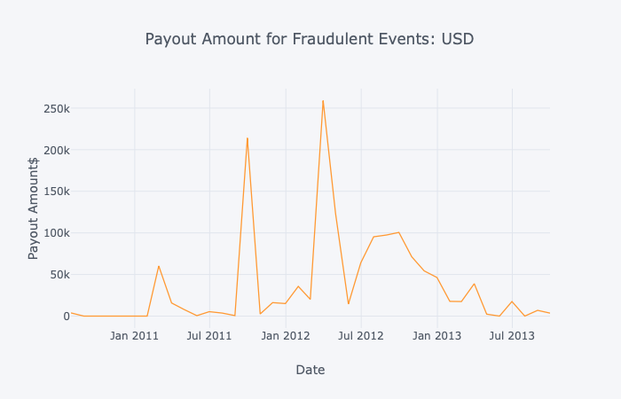
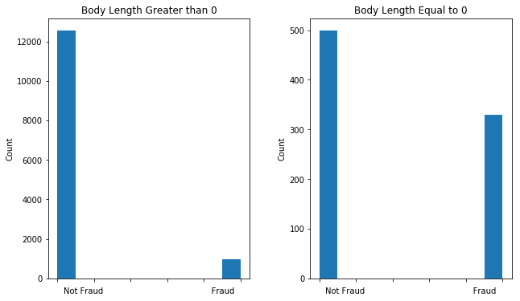
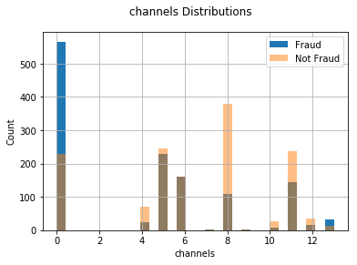
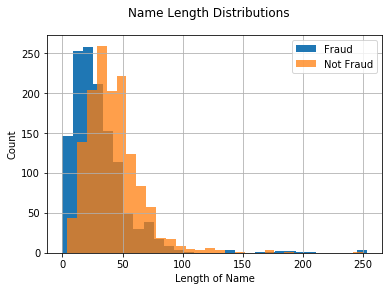
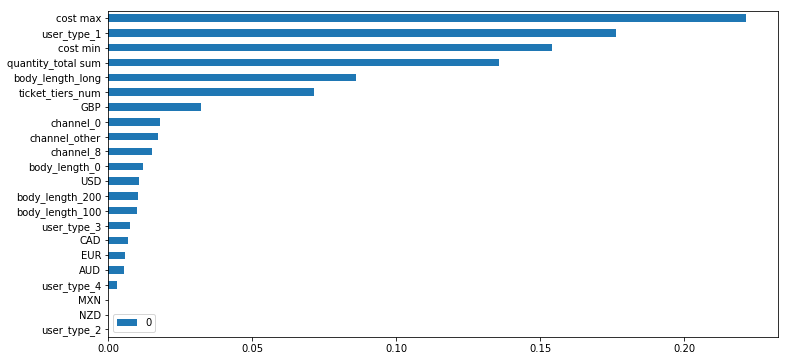

# Fraud Detection - Project Scope

## Introduction
EventDark is a company that runs a web based marketplace for events. 
They create a platform that makes it easy for event hosts to list their
event, sell/distribute tickets, and collect revenue. EventDark is 
experiencing problems with fraudulent event listings in their platform. 
There have been cases where users have bought tickets to fake events and 
payouts have been made to fraudulent hosts. In these cases, EventDark is
responsible to reimburse their users for lost value (alternatively they 
can choose to lose public trust and shut their doors). To avoid this 
problem, the company is now dedicating costly resources investigate 
potential fraud listings and shut them down.

As such, EventDark has tasked our boutique AI company, Fraudify, to provide 
a scalable solution to handle fraudulent event listings. 

### The problem: losing money to fraud

## Scope:
* Explore available data
* Perform EDA to determine signal in various features
* Develop pipeline to encapsulate cleaning, transforming, and splitting of data
* Train a suite of models and compare accuracy
* Select top performing model and tune hyperparameters to optimize for recall
* Develop web site to present visualizations on the problem (link: http://54.84.68.72:3333/)
* Include API in the website to receive new live data from client
* Create database to store data
* Call data from database, clean it, and run model to generate a prediction and present it on the web site

## Classification Prescriptions
The prediction probabilities were analyzed to determine valuable thresholds for high, medium, and low risk. High risk events can have a pause put on their account until an expert at the company can review it more closely. Moderate risk events will be reviewed by the investigation team at the company. This will help catch fraud with fewer resources being used.

### High Risk: 
* Model probability of 0.99 or higher
* Accounts for 19% of the fraud
* Expect 93% of these events to be fraud

### Moderate Risk:
* Model probability between 0.05 and 0.99
* Accounts for 64% of the fraud
* Expect 43% of these events to be fraud

### Low Risk:
* Model probability below 0.05
* About 17% of fraud will still be in this category

# Support:

### Signal Analysis

### Feature Importances

